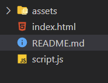

# Guess The Number

Before starting to code this project, please find a partner and play this game together verbally for a few rounds.

1. Alice thinks of a number
2. Bob guesses a number
3. Alice says "higher", "lower", or "correct"
4. repeat 2 & 3 until Bob guesses correctly
5. repeat 1-4 with Alice guessing

After you get a feel for the game, it's time to write a software version of the game, where the *computer* thinks of a number between 1 and 100 and the *player* tries to guess it.

Think carefully about how the computer will guess a number. Start with it guessing a [random number](https://developer.mozilla.org/en-US/docs/Web/JavaScript/Reference/Global_Objects/Math/random) between 1 and 100. Once that's working, high five, take a break, then try to use a more efficient guessing algorithm instead.

> "Make it work, make it right, make it fast -- in that order." - Kent Beck

---

## Workspace
You will see the following folder structure:



Within the ```index.html``` document, go ahead and run **Live Server** so that your default browser displays. This will be the interface that you will be testing within.

The only file that you will be working within to complete this project is within the ```script.js``` file. **Altering any other files can result in breaking this project.**

---

## Usage

Upon start up, a random number has been generated by the program. You will need to build out the functionality to allow for the computer to respond with:
```
Lower
Higher
The number was [number]!
```

Within the browser, the player will guess a number within the input field. Depending on the guess, the function will need to **return a string** that responds accordingly.

## Hints

* Before writing real code in a text editor, try writing *pseudocode* or a *flowchart* on paper. That will help you to understand the essence of the algorithm without getting bogged down in syntax (like semicolons and parentheses).


## Backlog

* **Test!** How could you write unit tests for a game like this? Are there any parts of the algorithm that you can extract into a function, then write tests for just that function?

* **Test first!** Now that you've written it once, throw it away! Start over from scratch, but this time, use *test-driven development*: write a test, watch it fail, make it pass, repeat.

* **Additionals** Try tracking the number of guesses. Include that into the return.
